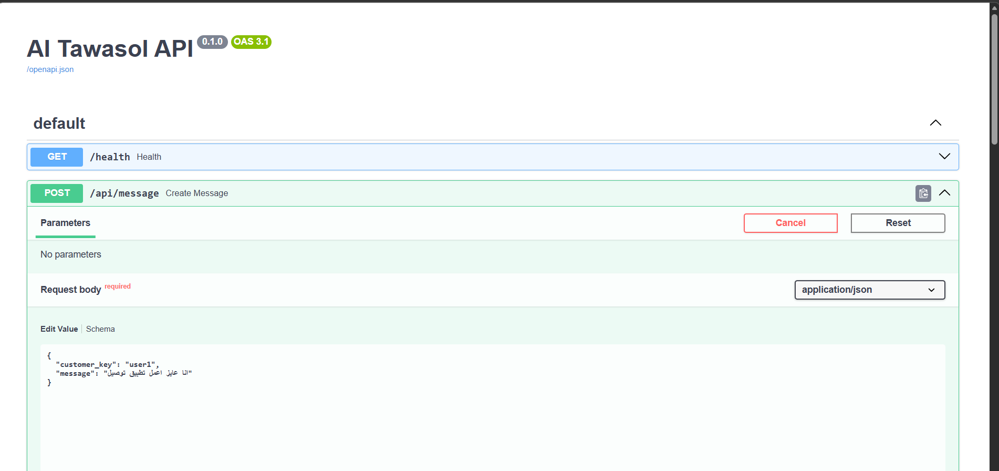

# AI Tawasol

AI Tawasol is an Arabic-first AI pre-sales agent for software houses and agencies.

The system is designed to talk to potential clients, understand their project needs, ask about missing requirements, and gradually build a structured view of the project before handing it to the sales team.

---

## Foundation v1:

We are building a text-only AI pre-sales core.

The system manages:

- customers
- conversations
- messages
- projects

The system exposes one API that receives messages and returns AI responses.

Scope of this phase:

- text only
- no dashboard
- no external integrations
- no audio

Architecture:

route -> message processor -> agent -> database

## Tech Stack

- Python
- FastAPI
- PostgreSQL
- SQLAlchemy
- Docker
- Gemini API

---

## Project Structure

```text
ai-tawasol
│
├─ app
│  ├─ api
│  ├─ core
│  ├─ db
│  ├─ models
│  ├─ schemas
│  ├─ services
│  └─ main.py
│
├─ docs
│  ├─ images
│  │   ├─ api-docs.png
│  │   ├─ architecture.png
│  │   └─ agent-flow.png
│  │
│  ├─ ARCHITECTURE.md
│  ├─ AGENT_FLOW.md
│  ├─ PROJECT_STATUS.md
│  └─ ROADMAP.md
│
├─ .env
├─ docker-compose.yml
├─ requirements.txt
└─ README.md


```md
## System Architecture


  ## Run Locally

### 1. Start PostgreSQL

```bash
 docker compose up -d 

### 2 Activate virtual environment

```bash
 .venv\Scripts\Activate.ps1

### 3 Run the API

```bash 
uvicorn app.main:app --reload 
### 4 Open docs

```bash
http://127.0.0.1:8000/docs   

## API Documentation 



---


### Documentation
More details inside the docs folder:

Architecture

Agent Flow

Project Status

Roadmap


### Product Vision

## AI Tawasol is not a chatbot.

It is an AI Pre-Sales Engineer that can:

understand client requirements

detect missing information

guide requirement discovery

prepare structured project details