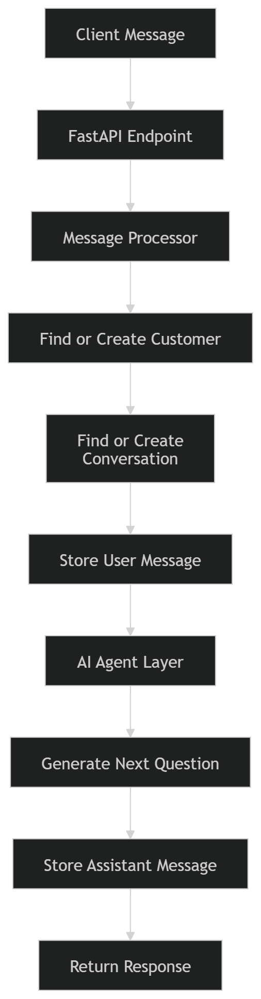

# AI Tawasol

<p align="center">
<strong>AI Tawasol</strong> is an Arabic-first AI pre-sales agent for software houses and agencies.
</p>

<p align="center">
It talks to potential clients, understands their project needs, asks about missing requirements, and builds a structured view of the project before handing it to the sales team.
</p>

---

# Features

* Arabic-first AI interaction
* AI-driven requirement discovery
* Structured project requirement extraction
* Conversation memory management
* Pre-sales intelligence workflow
* Clean backend architecture

---

# Foundation v1

We are building a **text-only AI pre-sales core**.

The system manages:

* customers
* conversations
* messages
* projects

The system exposes **one API** that receives messages and returns AI responses.

---

# Scope of this phase

* text only
* no dashboard
* no external integrations
* no audio

---

# Architecture

```
route → message processor → agent → database
```

More detailed architecture documentation:

* docs/ARCHITECTURE.md
* docs/AGENT_FLOW.md

---

# Tech Stack

* Python
* FastAPI
* PostgreSQL
* SQLAlchemy
* Docker
* Gemini API

---

# Project Structure

```
ai-tawasol
│
├─ app
│  ├─ api
│  ├─ core
│  ├─ db
│  ├─ models
│  ├─ schemas
│  ├─ services
│  └─ main.py
│
├─ docs
│  ├─ images
│  │   ├─ api-docs.png
│  │   ├─ architecture.png
│  │   └─ agent-flow.png
│  │
│  ├─ ARCHITECTURE.md
│  ├─ AGENT_FLOW.md
│  ├─ PROJECT_STATUS.md
│  └─ ROADMAP.md
│
├─ .env
├─ docker-compose.yml
├─ requirements.txt
└─ README.md
```

---

# System Architecture



---

# Agent Flow

The AI agent behaves like a **pre-sales engineer**.

Its goal is to understand the client's idea and collect project requirements.

Main pipeline:

Client Message
↓
API Route
↓
Message Processor
↓
Requirement Extraction
↓
Missing Field Detection
↓
Next Question Engine
↓
AI Response

Full documentation inside:

docs/AGENT_FLOW.md

---

# Run Locally

## 1 Start PostgreSQL

```bash
docker compose up -d
```

---

## 2 Activate virtual environment

```bash
.venv\Scripts\Activate.ps1
```

---

## 3 Run the API

```bash
uvicorn app.main:app --reload
```

---

## 4 Open API docs

```
http://127.0.0.1:8000/docs
```

---

# API Example

Example request:

```
POST /api/message
```

```json
{
 "customer_id": "123",
 "message": "I want to build a mobile app"
}
```

Example response:

```json
{
 "reply": "Great. What type of app are you looking to build?"
}
```

---

# Documentation

Full documentation inside the **docs folder**:

* docs/ARCHITECTURE.md
* docs/AGENT_FLOW.md
* docs/PROJECT_STATUS.md
* docs/ROADMAP.md

---

# Project Status

Current stage: **Backend foundation**

Completed:

* FastAPI server
* PostgreSQL with Docker
* API endpoint `/api/message`
* conversation storage
* message storage
* Swagger documentation
* repository structure

Currently working on:

* message endpoint logic
* database connection
* conversation handling

---

# Roadmap

### Phase 1

Backend foundation

* FastAPI
* PostgreSQL
* Docker
* message endpoint

### Phase 2

AI integration

* Gemini connection
* dynamic responses

### Phase 3

Pre-Sales Intelligence

* requirements extraction
* missing field detection
* next question generation

### Phase 4

Project Structuring

* store structured requirements
* project summary generation
* generate SRS

### Phase 5

Integrations

* website chat
* telegram
* whatsapp

---

# Product Vision

## AI Tawasol is not a chatbot

It is an **AI Pre-Sales Engineer** that can:

* understand client requirements
* detect missing information
* guide requirement discovery
* prepare structured project details
